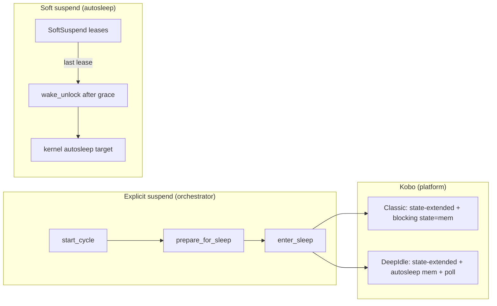

<!-- i18n:skip-start -->

# Suspend

Cadmus suspend code has three layers:

| Mechanism                                       | User sees                           | Code entry                                       | Typical trigger                                 |
| ----------------------------------------------- | ----------------------------------- | ------------------------------------------------ | ----------------------------------------------- |
| [**Explicit suspend**](orchestrator.md)         | Suspend intermission and deep sleep | `start_cycle` → prepare → `enter_sleep`          | Auto Suspend RTC, power button, sleep cover     |
| [**Soft suspend**](soft-suspend.md) (autosleep) | No explicit UI                      | Kernel autosleep after the wake lock is unlocked | Autosleep armed and no active SoftSuspend lease |
| [**Kobo platform**](kobo/suspend.md)            | Hardware hooks around sleep         | `KoboPowerManager`, `state-extended`             | Classic and DeepIdle sleep entry                |

User-facing soft suspend is in [Soft Suspend](../../../soft-suspend.md).
Research: [investigation #361](../../../investigations/kobo/issue-361-autosleep-wake-lock.md).

## How they interact



- **Auto Suspend** (minutes of idle) starts an **explicit** cycle via RTC —
  even when soft suspend is on, the orchestrator still runs prepare and enters
  Classic or DeepIdle.
- **Soft suspend** controls **opportunistic** naps while the app is interactive.
  A SoftSuspend lease keeps the wake lock held. After the last lease is
  released, the configured grace expires before the wake lock is unlocked.
- On Kobo, **DeepIdle** temporarily forces autosleep to `mem`, arms
  `state-extended`, drops its cycle lease, and polls for wake. **Classic** calls
  blocking `KoboPowerManager::suspend`.

The **emulator** only shows the suspend intermission. It does not prepare
hardware, enter kernel sleep, or drive this orchestrator.

## Blocking sleep with the inhibitor

Code that needs inhibitor behaviour acquires a guard through
<a href="/api/cadmus_core/device/inhibitor/struct.Inhibitor.html">`Inhibitor::acquire`</a>
— see [Inhibitor](inhibitor.md) for API detail, LED patterns, deferred suspend,
and OTA.

| Goal                                                                   | Acquire             | Effect                                                                                                                |
| ---------------------------------------------------------------------- | ------------------- | --------------------------------------------------------------------------------------------------------------------- |
| Keep device awake for **opportunistic** autosleep between events       | `Kind::SoftSuspend` | Holds kernel `cadmus` wake lock (Linux). **Does not** block explicit suspend.                                         |
| Block **explicit** suspend and user exits on Kobo during critical work | `Kind::Full`        | Defers `start_cycle`; ignores gated user exits. Registers a nested `"full-inhibit"` lease on the SoftSuspend backend. |

```rust
// Background work — block opportunistic nap only
let _guard = inhibitor.acquire(Kind::SoftSuspend, SoftSuspendName::Wifi)?;

// OTA install — block explicit suspend and user power-off/reboot
let _guard = inhibitor.acquire(Kind::Full, "ota")?;
```

Use standard names from
<a href="/api/cadmus_core/device/inhibitor/enum.SoftSuspendName.html">`SoftSuspendName`</a>
where they exist (`input`, `wifi`, `main-loop`, …). Full holders use free-form
names (`"ota"`, …).

## Pages

| Page                                    | Read this for                                                                          |
| --------------------------------------- | -------------------------------------------------------------------------------------- |
| [Suspend orchestrator](orchestrator.md) | `SuspendCycle` phases, Classic vs DeepIdle, RTC alarms, `start_cycle` vs `enter_sleep` |
| [Soft suspend](soft-suspend.md)         | Autosleep sysfs, wake-lock worker, grace, `SoftSuspendKind` backends                   |
| [Inhibitor](inhibitor.md)               | `Kind::SoftSuspend` vs `Kind::Full`, deferred suspend, exit gate, status LED, OTA      |
| [Kobo suspend](kobo/suspend.md)         | Lifecycle forwarding, `state-extended`, Classic vs DeepIdle on device                  |

<!-- i18n:skip-end -->
