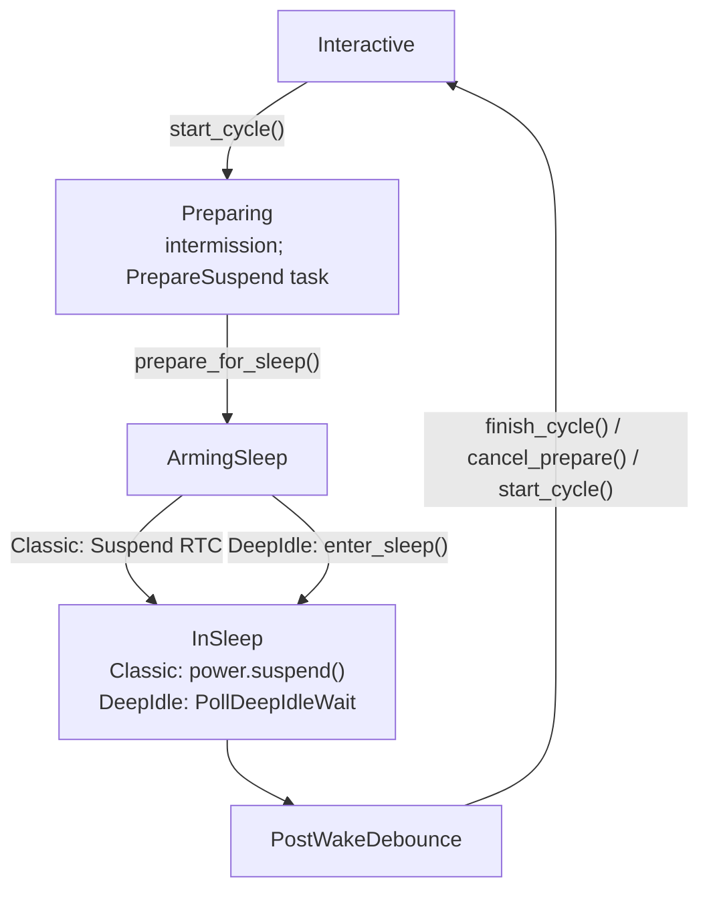

<!-- i18n:skip-start -->

# Suspend orchestrator

Shared explicit-suspend orchestration lives in
`crates/core/src/device/suspend/`. Soft-suspend leases / session details are in
[Soft Suspend](soft-suspend.md). Kobo-specific `state-extended` wiring is in
[Kobo suspend](kobo/suspend.md).

The **emulator** keeps a short UI-only suspend path and does **not** drive this
orchestrator, for now.

## Workflow

Callers that mean “go to sleep” (power button, AutoSuspend RTC, sleep cover)
call **`start_cycle`**, not `enter_sleep`. Sleep is a later phase.

| Function            | Role                                                       |
| ------------------- | ---------------------------------------------------------- |
| `start_cycle`       | Begin cycle: UI + schedule prepare                         |
| `prepare_for_sleep` | Shared teardown; arm classic RTC or enter DeepIdle         |
| `enter_sleep`       | Actually sleep (classic `power.suspend` or deep-idle wait) |
| `finish_cycle`      | Tear down cycle → interactive                              |
| `cancel_prepare`    | Abort during PrepareSuspend only                           |

`Event::Suspend` / `AlarmType::Suspend` mean **enter sleep now** (after
prepare), not “start a new cycle”.

## Kind and phase

An explicit suspend cycle is `Option<SuspendCycle>` on `AppContext`. Interactive
use is `None`.

| Field   | Values                                                                      |
| ------- | --------------------------------------------------------------------------- |
| `kind`  | `Classic` or `DeepIdle` — chosen once at `start_cycle`, fixed for the cycle |
| `phase` | `Preparing` → `ArmingSleep` → `InSleep` / wait → `PostWakeDebounce`         |

Mid-cycle handlers must not re-select Classic vs DeepIdle by probing
`is_armed()` alone. WakeDebounce and CalendarUpdate re-enter with the same kind.

## Backends

| Kind       | Sleep entry                                                               |
| ---------- | ------------------------------------------------------------------------- |
| `Classic`  | Blocking `PowerManager::suspend` / `resume`, then WakeDebounce RTC        |
| `DeepIdle` | Force autosleep `mem`, `arm_deep_idle`, drop cycle lease, poll until wake |

Both kinds share prepare teardown (settings, frontlight, Wi‑Fi) and post-wake
alarm handling (AutoPowerOff, CalendarUpdate, WakeDebounce).

## Deep-idle wake detect

Production wait uses `CLOCK_BOOTTIME` elapsed minus `CLOCK_MONOTONIC` elapsed
(threshold ~1s). Realtime / NTP steps alone must not look like a wake. Tests
inject `PollResult::{TimedOut, Woke}` via `AppContext::deep_idle_poll_inject`.

On timeout: retry deep idle while soft suspend can re-arm; if it cannot, **finish**
the cycle (clear intermission, restore Auto Suspend) instead of stalling.

## Phase-aware Suspend

| Situation                                       | Action                                      |
| ----------------------------------------------- | ------------------------------------------- |
| `Suspend` during `InSleep` / `PostWakeDebounce` | Ignore (do not finish)                      |
| Interactive + soft armed + classic `Suspend`    | Refuse classic; do not invent a stuck cycle |

<!-- i18n:skip-end -->
