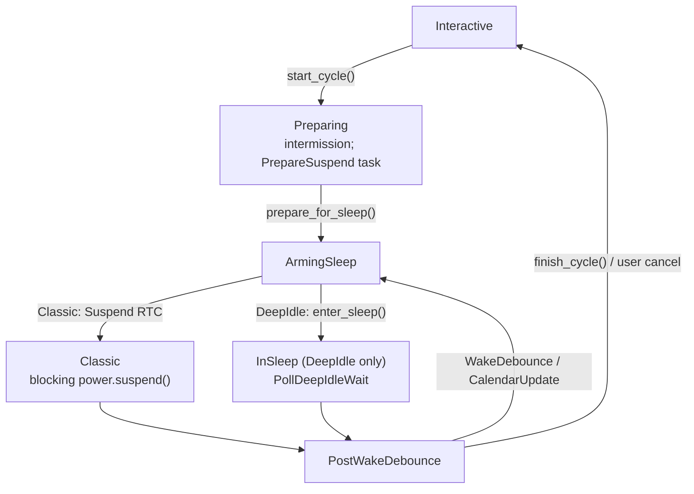

<!-- i18n:skip-start -->

# Suspend orchestrator

**Explicit** suspend: intermission UI, prepare teardown, then kernel sleep.
Shared code in
<a href="/api/cadmus_core/device/suspend/index.html">`device::suspend`</a>
(`crates/core/src/device/suspend/`).

This is separate from opportunistic [soft suspend](soft-suspend.md) and from
[Kobo platform hooks](kobo/suspend.md). To **block** starting a cycle, use
[Inhibitor `Kind::Full`](inhibitor.md) — SoftSuspend leases alone do not gate
`start_cycle`.

The emulator does not drive this module today.

## Workflow

Callers that mean “go to sleep” (power button, Auto Suspend RTC, sleep cover)
call
<a href="/api/cadmus_core/device/suspend/orchestrator/fn.start_cycle.html">`start_cycle`</a>,
**not**
<a href="/api/cadmus_core/device/suspend/orchestrator/fn.enter_sleep.html">`enter_sleep`</a>.

| Function            | Role                                                    |
| ------------------- | ------------------------------------------------------- |
| `start_cycle`       | Begin cycle: UI + schedule prepare                      |
| `prepare_for_sleep` | Teardown; arm Classic Suspend RTC or enter DeepIdle     |
| `enter_sleep`       | Kernel sleep (classic block or deep-idle poll)          |
| `finish_cycle`      | Tear down → interactive                                 |
| `cancel_prepare`    | Remove a stray PrepareSuspend task when no cycle exists |

<a href="/api/cadmus_core/view/enum.Event.html#variant.Suspend">`Event::Suspend`</a>
/
<a href="/api/cadmus_core/device/rtc/enum.AlarmType.html#variant.Suspend">`AlarmType::Suspend`</a>
mean **enter sleep now** (after prepare), not “start a new cycle”.

Full inhibit defers `start_cycle` — [Inhibitor § Deferred explicit suspend](inhibitor.md#deferred-explicit-suspend).

## Kind and phase

`Option<`<a href="/api/cadmus_core/device/suspend/cycle/struct.SuspendCycle.html">`SuspendCycle`</a>`>`
on
<a href="/api/cadmus_core/context/struct.Context.html#structfield.suspend">`Context::suspend`</a>.
Interactive use is `None`.

| Field   | Values                                                                                       |
| ------- | -------------------------------------------------------------------------------------------- |
| `kind`  | `Classic` or `DeepIdle` — fixed at `start_cycle` for the cycle                               |
| `phase` | `Preparing` → `ArmingSleep` → `PostWakeDebounce`; DeepIdle also uses `InSleep` while polling |

Do not re-pick Classic vs DeepIdle mid-cycle from
<a href="/api/cadmus_core/device/soft_suspend/mode/enum.AutosleepMode.html#method.is_armed">`is_armed()`</a>
alone. WakeDebounce / CalendarUpdate re-enter with the same kind.

## Sleep backends

| Kind       | Entry                                                             |
| ---------- | ----------------------------------------------------------------- |
| `Classic`  | Suspend RTC, then blocking `PowerManager::suspend` / `resume`     |
| `DeepIdle` | Force autosleep `mem`, `arm_deep_idle`, poll until wake / timeout |

Both share prepare teardown and schedule WakeDebounce after wake. AutoPowerOff
and CalendarUpdate alarms are scheduled before sleep when their settings
require them, then checked after wake. Platform details:
[Kobo suspend](kobo/suspend.md).

## Deep-idle wake detect

Production: `CLOCK_BOOTTIME` − `CLOCK_MONOTONIC` (~1 s threshold). Tests inject
<a href="/api/cadmus_core/device/suspend/wake/enum.PollResult.html">`PollResult`</a>
via `AppContext::deep_idle_poll_inject`.

On timeout: retry while soft suspend can re-arm; otherwise `finish_cycle`.

## Phase-aware Suspend

| Situation                                                  | Action                          |
| ---------------------------------------------------------- | ------------------------------- |
| `Suspend` during `InSleep` / `PostWakeDebounce`            | Ignore                          |
| Interactive + soft armed + classic `Suspend` without cycle | Refuse; reschedule Auto Suspend |

<!-- i18n:skip-end -->
