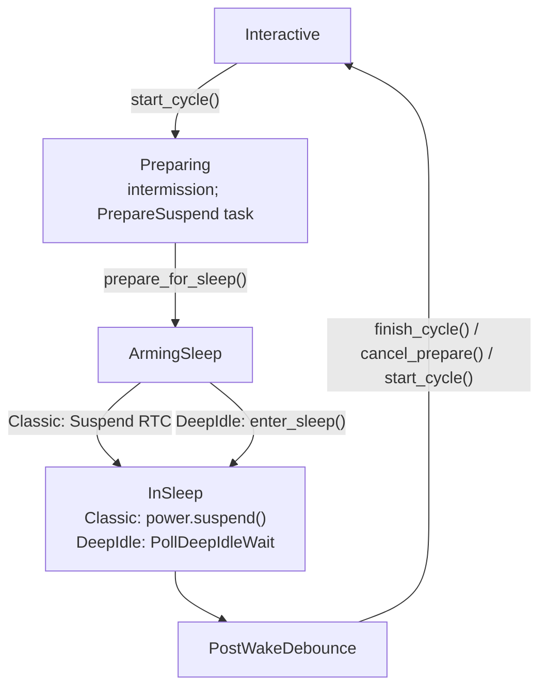

<!-- i18n:skip-start -->

# Suspend orchestrator

Shared explicit-suspend orchestration lives in
<a href="/api/cadmus_core/device/suspend/index.html">`device::suspend`</a>
(`crates/core/src/device/suspend/`). Soft-suspend leases / session details are
in [Soft Suspend](soft-suspend.md). Kobo-specific `state-extended` wiring is in
[Kobo suspend](kobo/suspend.md).

The **emulator** keeps a short UI-only suspend path and does **not** drive this
orchestrator, for now.

## Workflow

Callers that mean “go to sleep” (power button, AutoSuspend RTC, sleep cover)
call
**<a href="/api/cadmus_core/device/suspend/orchestrator/fn.start_cycle.html">`start_cycle`</a>**,
not
<a href="/api/cadmus_core/device/suspend/orchestrator/fn.enter_sleep.html">`enter_sleep`</a>.
Sleep is a later phase.

| Function                                                                                                 | Role                                                       |
| -------------------------------------------------------------------------------------------------------- | ---------------------------------------------------------- |
| <a href="/api/cadmus_core/device/suspend/orchestrator/fn.start_cycle.html">`start_cycle`</a>             | Begin cycle: UI + schedule prepare                         |
| <a href="/api/cadmus_core/device/suspend/orchestrator/fn.prepare_for_sleep.html">`prepare_for_sleep`</a> | Shared teardown; arm classic RTC or enter DeepIdle         |
| <a href="/api/cadmus_core/device/suspend/orchestrator/fn.enter_sleep.html">`enter_sleep`</a>             | Actually sleep (classic `power.suspend` or deep-idle wait) |
| <a href="/api/cadmus_core/device/suspend/orchestrator/fn.finish_cycle.html">`finish_cycle`</a>           | Tear down cycle → interactive                              |
| <a href="/api/cadmus_core/device/suspend/orchestrator/fn.cancel_prepare.html">`cancel_prepare`</a>       | Abort during PrepareSuspend only                           |

<a href="/api/cadmus_core/view/enum.Event.html#variant.Suspend">`Event::Suspend`</a>
/
<a href="/api/cadmus_core/device/rtc/enum.AlarmType.html#variant.Suspend">`AlarmType::Suspend`</a>
mean **enter sleep now** (after prepare), not “start a new cycle”.

## Kind and phase

An explicit suspend cycle is
`Option<`<a href="/api/cadmus_core/device/suspend/cycle/struct.SuspendCycle.html">SuspendCycle</a>`>`
on <a href="/api/cadmus_core/device/type.AppContext.html">`AppContext`</a>
(<a href="/api/cadmus_core/context/struct.Context.html#structfield.suspend">`suspend`</a>
field). Interactive use is `None`.

| Field   | Values                                                                                                                                                                                                                                                                                                                                                                                                                                                         |
| ------- | -------------------------------------------------------------------------------------------------------------------------------------------------------------------------------------------------------------------------------------------------------------------------------------------------------------------------------------------------------------------------------------------------------------------------------------------------------------- |
| `kind`  | <a href="/api/cadmus_core/device/suspend/cycle/enum.SuspendKind.html#variant.Classic">`Classic`</a> or <a href="/api/cadmus_core/device/suspend/cycle/enum.SuspendKind.html#variant.DeepIdle">`DeepIdle`</a> — chosen once at <a href="/api/cadmus_core/device/suspend/orchestrator/fn.start_cycle.html">`start_cycle`</a>, fixed for the cycle                                                                                                                |
| `phase` | <a href="/api/cadmus_core/device/suspend/cycle/enum.SuspendPhase.html#variant.Preparing">`Preparing`</a> → <a href="/api/cadmus_core/device/suspend/cycle/enum.SuspendPhase.html#variant.ArmingSleep">`ArmingSleep`</a> → <a href="/api/cadmus_core/device/suspend/cycle/enum.SuspendPhase.html#variant.InSleep">`InSleep`</a> / wait → <a href="/api/cadmus_core/device/suspend/cycle/enum.SuspendPhase.html#variant.PostWakeDebounce">`PostWakeDebounce`</a> |

Mid-cycle handlers must not re-select Classic vs DeepIdle by probing
<a href="/api/cadmus_core/device/soft_suspend/enum.AutosleepMode.html#method.is_armed">`is_armed()`</a>
alone. WakeDebounce and CalendarUpdate re-enter with the same kind.

## Backends

| Kind                                                                                                  | Sleep entry                                                                                                                                                                                                                             |
| ----------------------------------------------------------------------------------------------------- | --------------------------------------------------------------------------------------------------------------------------------------------------------------------------------------------------------------------------------------- |
| <a href="/api/cadmus_core/device/suspend/cycle/enum.SuspendKind.html#variant.Classic">`Classic`</a>   | Blocking <a href="/api/cadmus_core/device/power/trait.PowerManager.html#method.suspend">`PowerManager::suspend`</a> / <a href="/api/cadmus_core/device/power/trait.PowerManager.html#method.resume">`resume`</a>, then WakeDebounce RTC |
| <a href="/api/cadmus_core/device/suspend/cycle/enum.SuspendKind.html#variant.DeepIdle">`DeepIdle`</a> | Force autosleep `mem`, <a href="/api/cadmus_core/device/power/trait.PowerManager.html#method.arm_deep_idle">`arm_deep_idle`</a>, drop cycle lease, poll until wake                                                                      |

Both kinds share prepare teardown (settings, frontlight, Wi‑Fi) and post-wake
alarm handling (AutoPowerOff, CalendarUpdate, WakeDebounce).

## Deep-idle wake detect

Production wait uses `CLOCK_BOOTTIME` elapsed minus `CLOCK_MONOTONIC` elapsed
(threshold ~1s). Realtime / NTP steps alone must not look like a wake. Tests
inject
<a href="/api/cadmus_core/device/suspend/wake/enum.PollResult.html#variant.TimedOut">`PollResult::TimedOut`</a>
/
<a href="/api/cadmus_core/device/suspend/wake/enum.PollResult.html#variant.Woke">`Woke`</a>
via `AppContext::deep_idle_poll_inject`.

On timeout: retry deep idle while soft suspend can re-arm; if it cannot, **finish**
the cycle (clear intermission, restore Auto Suspend) instead of stalling.

## Phase-aware Suspend

| Situation                                                                                                                                                                                                                                                                                                          | Action                                      |
| ------------------------------------------------------------------------------------------------------------------------------------------------------------------------------------------------------------------------------------------------------------------------------------------------------------------ | ------------------------------------------- |
| <a href="/api/cadmus_core/view/enum.Event.html#variant.Suspend">`Suspend`</a> during <a href="/api/cadmus_core/device/suspend/cycle/enum.SuspendPhase.html#variant.InSleep">`InSleep`</a> / <a href="/api/cadmus_core/device/suspend/cycle/enum.SuspendPhase.html#variant.PostWakeDebounce">`PostWakeDebounce`</a> | Ignore (do not finish)                      |
| Interactive + soft armed + classic <a href="/api/cadmus_core/view/enum.Event.html#variant.Suspend">`Suspend`</a>                                                                                                                                                                                                   | Refuse classic; do not invent a stuck cycle |

<!-- i18n:skip-end -->
