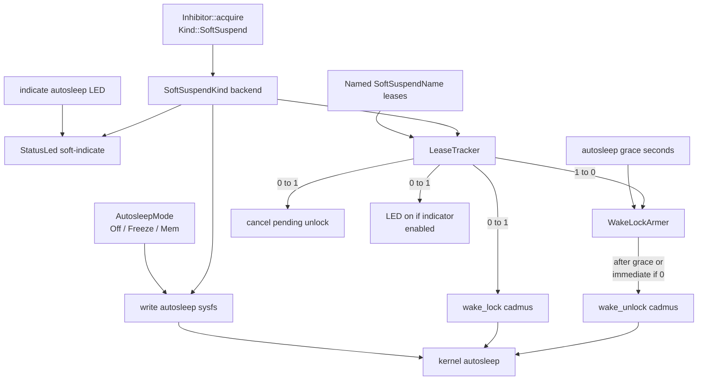

<!-- i18n:skip-start -->

# Soft Suspend

Cadmus soft suspend is an opt-in opportunistic sleep path driven by the
kernel autosleep workqueue and a single userspace wake lock. User-facing
behaviour is documented in [Soft Suspend](../../../soft-suspend.md). Research that
led to this design is in
[investigation #361](../../../investigations/kobo/issue-361-autosleep-wake-lock.md).

Kobo Auto Suspend / deep-idle integration (RTC deadline, `state-extended`,
cycle lease, PrepareSuspend delays) is documented separately in
[Kobo suspend](kobo/suspend.md). Shared cycle orchestration is in
[Suspend orchestrator](orchestrator.md).

## Architecture

<a href="/api/cadmus_core/device/inhibitor/struct.Inhibitor.html">`Inhibitor`</a>
is the single entry point for inhibit leases and SoftSuspend settings.
It orchestrates two kinds:

| Kind                                                                                             | Wake lock                 | Blocks Cadmus suspend | Blocks user exits |
| ------------------------------------------------------------------------------------------------ | ------------------------- | --------------------- | ----------------- |
| <a href="/api/cadmus_core/device/inhibitor/enum.Kind.html#variant.SoftSuspend">`SoftSuspend`</a> | Yes (Linux)               | No                    | No                |
| <a href="/api/cadmus_core/device/inhibitor/enum.Kind.html#variant.Full">`Full`</a>               | Yes (implies SoftSuspend) | Yes (planned)         | Yes (planned)     |

Callers acquire a named lease with
<a href="/api/cadmus_core/device/inhibitor/struct.Inhibitor.html#method.acquire">`Inhibitor::acquire`</a>,
which returns an
<a href="/api/cadmus_core/device/inhibitor/struct.InhibitorGuard.html">`InhibitorGuard`</a>
(RAII — drop to release). Use
<a href="/api/cadmus_core/device/inhibitor/enum.SoftSuspendName.html">`SoftSuspendName`</a>
for standard SoftSuspend holder names (`input`, `wifi`, `main-loop`, …).

<a href="/api/cadmus_core/device/inhibitor/enum.Kind.html#variant.Full">`Kind::Full`</a>
is reserved for OTA and other critical sections that must block Cadmus suspend
and user exits. It is not implemented yet:
<a href="/api/cadmus_core/device/inhibitor/struct.Inhibitor.html#method.acquire">`Inhibitor::acquire`</a>
panics for that kind until the follow-up work lands.

### Backends and device wiring

SoftSuspend behaviour is injected as `SoftSuspendKind` (`Arc<dyn SoftSuspendKind>`
inside the inhibitor; see
<a href="/api/cadmus_core/device/inhibitor/index.html">`device::inhibitor`</a>):

- **Linux** — live backend built from a sysfs probe
  (<a href="/api/cadmus_core/device/linux/soft_suspend/index.html">`device::linux::soft_suspend`</a>):
  one shared `cadmus` wake lock, autosleep mode via
  <a href="/api/cadmus_core/device/soft_suspend/mode/enum.AutosleepMode.html">`AutosleepMode`</a>,
  and optional soft-indicate on a shared
  <a href="/api/cadmus_core/device/leds/struct.StatusLed.html">`StatusLed`</a>
  arbiter.
- **NoOp** — inert backend: empty leases, no sysfs, no unlock worker. Used when
  the probe fails or on emulator / test hosts.

<a href="/api/cadmus_core/device/trait.DeviceHardware.html#method.inhibitor">`DeviceHardware::inhibitor`</a>
returns the device inhibitor. The default is
<a href="/api/cadmus_core/device/inhibitor/struct.Inhibitor.html#method.noop">`Inhibitor::noop`</a>.
Kobo calls
<a href="/api/cadmus_core/device/inhibitor/struct.Inhibitor.html#method.from_system">`Inhibitor::from_system`</a>,
which probes `/sys/power/autosleep`, `wake_lock`, and `wake_unlock` (must exist
and be writable) plus readable `/sys/power/state`. Any miss or `EPERM` falls
back to NoOp with one log; Cadmus does not retry sysfs writes. Power settings
hide Soft Suspend mode, LED, and grace when
<a href="/api/cadmus_core/device/soft_suspend/trait.SoftSuspendBackend.html#method.is_supported">`is_supported`</a>
is false.

The inhibitor is stored on
<a href="/api/cadmus_core/context/struct.Context.html#structfield.inhibitor">`Context::inhibitor`</a>
and shared with
<a href="/api/cadmus_core/device/wifi/struct.WifiSession.html">`WifiSession`</a>
so radio work can pin SoftSuspend while online.

### Settings contract

Power UI and lifecycle code configure autosleep through
<a href="/api/cadmus_core/device/soft_suspend/trait.SoftSuspendBackend.html">`SoftSuspendBackend`</a>,
which
<a href="/api/cadmus_core/device/inhibitor/struct.Inhibitor.html">`Inhibitor`</a>
implements by delegating to the injected SoftSuspend kind. Lease acquire is
**not** on this trait — use
<a href="/api/cadmus_core/device/inhibitor/struct.Inhibitor.html#method.acquire">`Inhibitor::acquire`</a>.

On Linux, the live kind coordinates:

- Reading `/sys/power/state` to discover available targets
- Writing `/sys/power/autosleep`
  (<a href="/api/cadmus_core/device/soft_suspend/mode/enum.AutosleepMode.html#variant.Off">`off`</a>
  /
  <a href="/api/cadmus_core/device/soft_suspend/mode/enum.AutosleepMode.html#variant.Freeze">`freeze`</a>
  /
  <a href="/api/cadmus_core/device/soft_suspend/mode/enum.AutosleepMode.html#variant.Mem">`mem`</a>)
- A
  <a href="/api/cadmus_core/lease/struct.LeaseTracker.html">`LeaseTracker`</a>
  whose observer maps 0→1 to the single kernel lock name `cadmus`, and 1→0 to a
  deferred `wake_unlock` after autosleep grace seconds (zero = unlock
  immediately). A new lease during the grace cancels the pending unlock.
- Optional LED indicator via
  <a href="/api/cadmus_core/device/leds/trait.DeviceLeds.html">`DeviceLeds`</a>
  through the shared
  <a href="/api/cadmus_core/device/leds/struct.StatusLed.html">`StatusLed`</a>
  arbiter (`soft-indicate` command while autosleep is armed and the setting is
  enabled).

The probe opens nodes for write without writing `"cadmus"` or an autosleep
token.

Upstream references:
[sysfs-power ABI](https://www.kernel.org/doc/Documentation/ABI/testing/sysfs-power)
(`autosleep`, `wake_lock`, `wake_unlock`, `state`).

## Lease holders

Named leases only adjust the Cadmus refcount; the kernel still sees one lock
(`cadmus`). Holders include the main loop, input, Wi‑Fi, and background
tasks while they run. Dropping the last lease (after grace) lets the kernel
enter the armed
<a href="/api/cadmus_core/device/soft_suspend/mode/enum.AutosleepMode.html">`AutosleepMode`</a>
target.

<!-- i18n:skip-end -->
