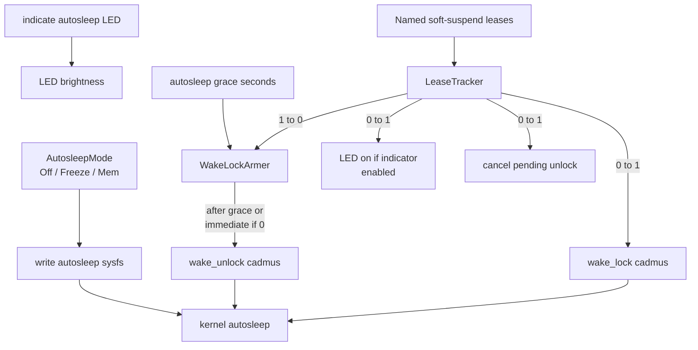

<!-- i18n:skip-start -->

# Soft Suspend

Cadmus soft suspend is an opt-in opportunistic sleep path driven by the
kernel autosleep workqueue and a single userspace wake lock. User-facing
behaviour is documented in [Soft Suspend](../../../soft-suspend.md). Research that
led to this design is in
[investigation #361](../../../investigations/kobo/issue-361-autosleep-wake-lock.md).

Kobo Auto Suspend / deep-idle integration (RTC deadline, `state-extended`,
cycle lease, PrepareSuspend delays) is documented separately in
[Kobo suspend](kobo/suspend.md). Shared cycle orchestration is in
[Suspend orchestrator](orchestrator.md).

## Architecture

`SoftSuspendSession` owns:

- Reading `/sys/power/state` to discover available targets
- Writing `/sys/power/autosleep` (`off` / `freeze` / `mem`)
- A lease tracker whose observer maps 0→1 to the single kernel lock name
  `cadmus`, and 1→0 to a deferred `wake_unlock` after autosleep grace
  seconds (zero = unlock immediately). A new lease during the grace cancels
  the pending unlock.
- Optional LED indicator via `DeviceLeds`

Missing autosleep / wake_lock sysfs is a no-op (emulator and hosts without
those nodes).

Upstream references:
[sysfs-power ABI](https://www.kernel.org/doc/Documentation/ABI/testing/sysfs-power)
(`autosleep`, `wake_lock`, `wake_unlock`, `state`).

## Lease holders

Named leases only adjust the Cadmus refcount; the kernel still sees one lock
(`cadmus`). Holders include the main loop, input, Wi‑Fi, and background
tasks while they run. Dropping the last lease (after grace) lets the kernel
enter the armed autosleep target.

<!-- i18n:skip-end -->
