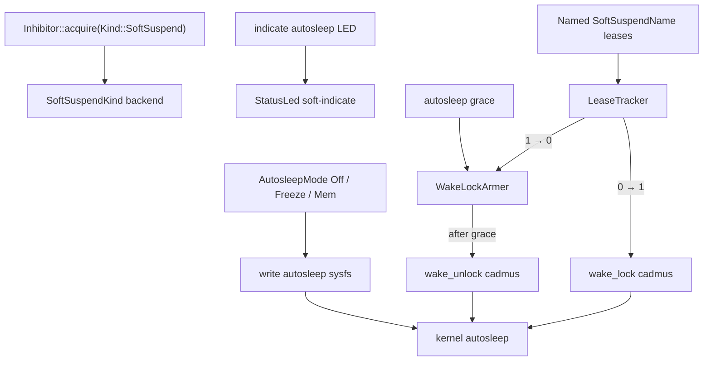

<!-- i18n:skip-start -->

# Soft suspend

Opt-in **opportunistic** sleep: the kernel autosleep workqueue naps between
Cadmus events when nothing holds the userspace wake lock. This is **not** the
Auto Suspend intermission path — that is
[explicit suspend](orchestrator.md).

User-facing behaviour: [Soft Suspend](../../../soft-suspend.md).

## Architecture

Acquire leases through
<a href="/api/cadmus_core/device/inhibitor/struct.Inhibitor.html#method.acquire">`Inhibitor::acquire(Kind::SoftSuspend, …)`</a>.
To also block **explicit** suspend, use
<a href="/api/cadmus_core/device/inhibitor/enum.Kind.html#variant.Full">`Kind::Full`</a>
— [Inhibitor](inhibitor.md).

## Backends

`SoftSuspendKind` is injected into
<a href="/api/cadmus_core/device/inhibitor/struct.Inhibitor.html">`Inhibitor`</a>
at construction:

| Backend   | When                   | Behaviour                                                                   |
| --------- | ---------------------- | --------------------------------------------------------------------------- |
| **Linux** | Sysfs probe succeeds   | One shared `cadmus` wake lock, autosleep mode, optional `soft-indicate` LED |
| **NoOp**  | Probe fails / emulator | Tracks leases in process; no sysfs or unlock worker                         |

Kobo uses
<a href="/api/cadmus_core/device/inhibitor/struct.Inhibitor.html#method.from_system">`Inhibitor::from_system`</a>,
which requires writable `/sys/power/autosleep`, `wake_lock`, `wake_unlock` and
readable `/sys/power/state`. Power settings hide Soft Suspend rows when
<a href="/api/cadmus_core/device/soft_suspend/trait.SoftSuspendBackend.html#method.is_supported">`is_supported`</a>
is false.

Implementation: `crates/core/src/device/linux/soft_suspend/`.

## Settings

Power UI configures autosleep via
<a href="/api/cadmus_core/device/soft_suspend/trait.SoftSuspendBackend.html">`SoftSuspendBackend`</a>
(implemented by `Inhibitor`). Lease acquire is **not** on this trait.

On Linux the live kind:

- Writes `/sys/power/autosleep` (`off` / `freeze` / `mem`)
- Maps lease tracker 0→1 to `wake_lock cadmus`, 1→0 to deferred `wake_unlock`
  after **autosleep grace** (new lease during grace cancels pending unlock)
- Optionally drives `soft-indicate` on the shared
  <a href="/api/cadmus_core/device/leds/struct.StatusLed.html">`StatusLed`</a>
  arbiter ([priorities in Inhibitor doc](inhibitor.md#status-led-arbiter))

Upstream:
[sysfs-power ABI](https://www.kernel.org/doc/Documentation/ABI/testing/sysfs-power).

## Typical lease holders

Named leases only adjust Cadmus’s refcount; the kernel sees one lock (`cadmus`):

main loop, input, Wi‑Fi session, background tasks. Dropping the last lease (after
grace) lets the kernel enter the armed autosleep target.

Kobo **DeepIdle** explicit suspend also forces `mem` autosleep during the cycle
— see [Kobo suspend](kobo/suspend.md).

<!-- i18n:skip-end -->
