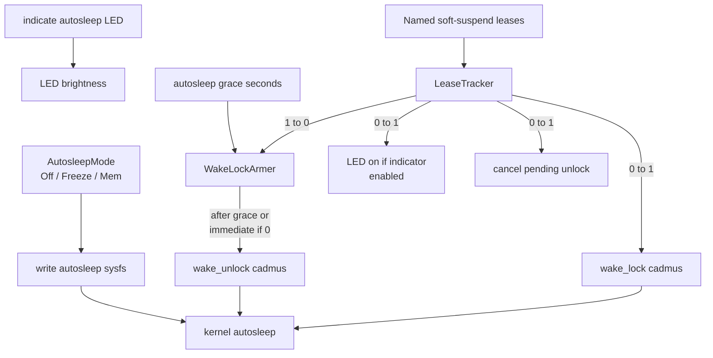

<!-- i18n:skip-start -->

# Soft Suspend

Cadmus soft suspend is an opt-in opportunistic sleep path driven by the
kernel autosleep workqueue and a single userspace wake lock. User-facing
behaviour is documented in [Soft Suspend](../../../soft-suspend.md). Research that
led to this design is in
[investigation #361](../../../investigations/kobo/issue-361-autosleep-wake-lock.md).

Kobo Auto Suspend / deep-idle integration (RTC deadline, `state-extended`,
cycle lease, PrepareSuspend delays) is documented separately in
[Kobo suspend](kobo/suspend.md). Shared cycle orchestration is in
[Suspend orchestrator](orchestrator.md).

## Architecture

<a href="/api/cadmus_core/device/soft_suspend/enum.SoftSuspend.html">`SoftSuspend`</a>
is a closed enum:

- <a href="/api/cadmus_core/device/soft_suspend/enum.SoftSuspend.html#variant.Linux">`Linux`</a>
  wraps
  <a href="/api/cadmus_core/device/linux/soft_suspend/session/struct.SoftSuspendSession.html">`SoftSuspendSession`</a>
  after a construction-time probe succeeds.
- <a href="/api/cadmus_core/device/soft_suspend/enum.SoftSuspend.html#variant.NoOp">`NoOp`</a>
  is
  <a href="/api/cadmus_core/device/soft_suspend/noop/struct.NoOpSoftSuspend.html">`NoOpSoftSuspend`</a>:
  unarmed, empty leases, no sysfs, no unlock worker.

<a href="/api/cadmus_core/device/trait.DeviceHardware.html#method.soft_suspend">`DeviceHardware::soft_suspend`</a>
returns the backend for that device. Emulator and `TestDevice` keep the
default `NoOp`. Kobo, which runs Linux, it probes `/sys/power/autosleep`, `wake_lock`,
and `wake_unlock` (must exist and be writable) plus readable
`/sys/power/state`. Any miss or `EPERM` becomes `NoOp` with one log; Cadmus
does not retry sysfs writes. Power settings hide Soft Suspend mode, LED, and
grace when `is_supported` is false. The portable enum lives in
<a href="/api/cadmus_core/device/soft_suspend/enum.SoftSuspend.html">`device::soft_suspend`</a>;
the sysfs session is
<a href="/api/cadmus_core/device/linux/soft_suspend/index.html">`device::linux::soft_suspend`</a>.

When the Linux variant is used, `SoftSuspendSession` owns:

- Reading `/sys/power/state` to discover available targets
- Writing `/sys/power/autosleep`
  (<a href="/api/cadmus_core/device/soft_suspend/mode/enum.AutosleepMode.html#variant.Off">`off`</a>
  /
  <a href="/api/cadmus_core/device/soft_suspend/mode/enum.AutosleepMode.html#variant.Freeze">`freeze`</a>
  /
  <a href="/api/cadmus_core/device/soft_suspend/mode/enum.AutosleepMode.html#variant.Mem">`mem`</a>)
- A
  <a href="/api/cadmus_core/lease/struct.LeaseTracker.html">`LeaseTracker`</a>
  whose observer maps 0→1 to the single kernel lock name `cadmus`, and 1→0 to a
  deferred `wake_unlock` via
  <a href="/api/cadmus_core/device/linux/soft_suspend/session/struct.WakeLockArmer.html">`WakeLockArmer`</a>
  after autosleep grace seconds (zero = unlock immediately). A new lease during
  the grace cancels the pending unlock.
- Optional LED indicator via
  <a href="/api/cadmus_core/device/leds/trait.DeviceLeds.html">`DeviceLeds`</a>

The probe opens nodes for write without writing `"cadmus"` or an autosleep
token.

Upstream references:
[sysfs-power ABI](https://www.kernel.org/doc/Documentation/ABI/testing/sysfs-power)
(`autosleep`, `wake_lock`, `wake_unlock`, `state`).

## Lease holders

Named leases only adjust the Cadmus refcount; the kernel still sees one lock
(`cadmus`). Holders include the main loop, input, Wi‑Fi, and background
tasks while they run. Dropping the last lease (after grace) lets the kernel
enter the armed
<a href="/api/cadmus_core/device/soft_suspend/mode/enum.AutosleepMode.html">`AutosleepMode`</a>
target.

<!-- i18n:skip-end -->
