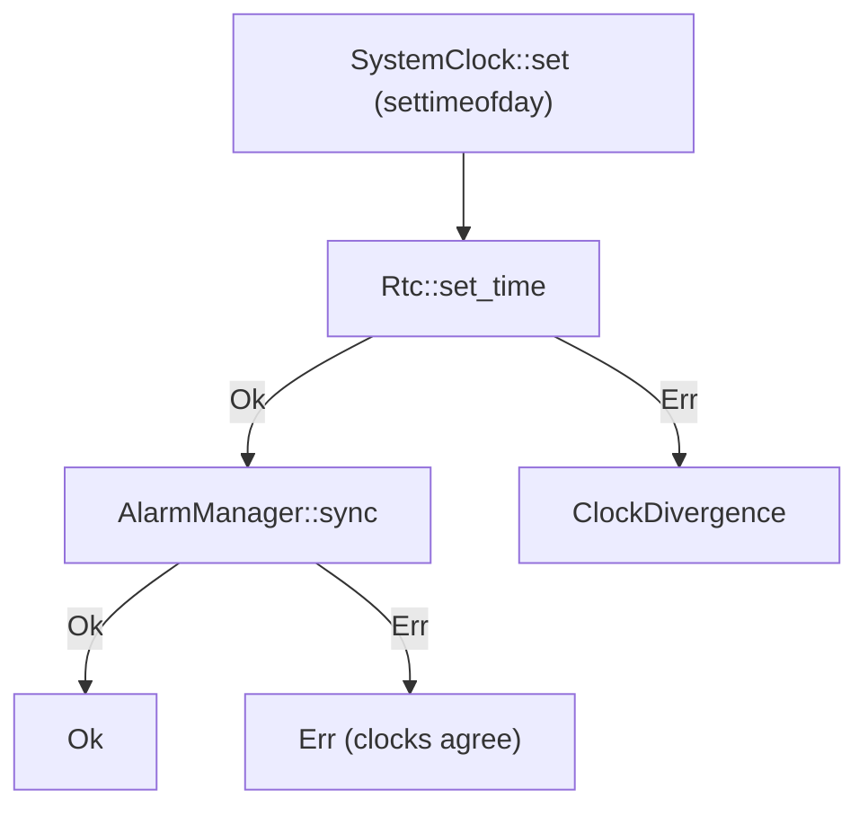
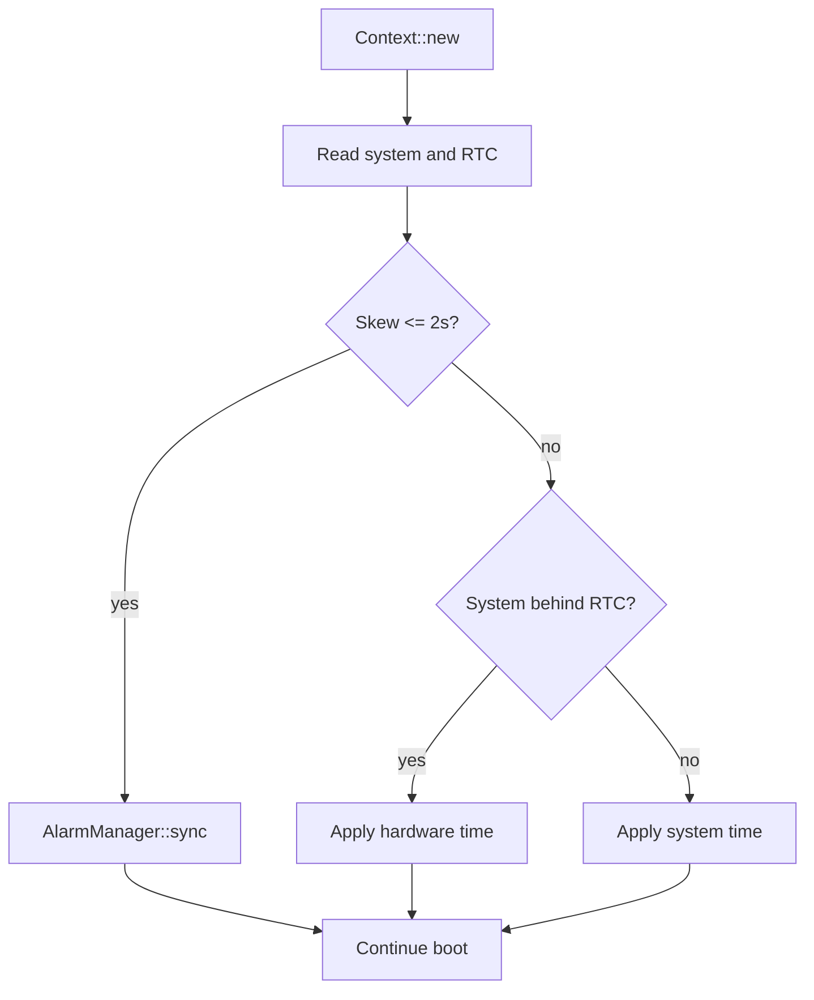

<!-- i18n:skip-start -->

# Time and RTC

Cadmus keeps two clocks. They are updated on one apply path, and brought back
into agreement at startup.
<a href="/api/cadmus_core/device/rtc/struct.AlarmManager.html">`AlarmManager`</a>
treats the hardware RTC as authority, so a split pair leaves the UI on one
timeline and wake alarms on another.

User-facing NTP behaviour is in [Automatic Time Syncing](../../time-sync.md).
RTC wake alarms used by sleep are in [Suspend](suspend/index.md).

## Two clocks

| Clock                        | What it is                                               | Who uses it                                                                                                            |
| ---------------------------- | -------------------------------------------------------- | ---------------------------------------------------------------------------------------------------------------------- |
| **System / civil wall time** | Linux `CLOCK_REALTIME` via `settimeofday` / `Utc::now()` | UI clock, NTP, civil alarm intents, timezone                                                                           |
| **Hardware RTC**             | Battery-backed chip                                      | <a href="/api/cadmus_core/device/rtc/struct.AlarmManager.html">`AlarmManager`</a>, suspend/wake, time across power-off |

**Civil** means the system wall clock — what the status bar and NTP use — not
the hardware RTC register. See
<a href="/api/cadmus_core/device/rtc/enum.ClockInstant.html">`ClockInstant`</a>.

The emulator has an RTC test double and a time manager. Scheduling
<a href="/api/cadmus_core/task/time_sync/struct.TimeSyncTask.html">`TimeSyncTask`</a>
from
<a href="/api/cadmus_core/input/enum.DeviceEvent.html#variant.NetUp">`NetUp`</a>
/ **Sync Time** is `kobo`-gated.

## Components

| Piece                                                                                 | Role                                                                                                                                                                                                                  |
| ------------------------------------------------------------------------------------- | --------------------------------------------------------------------------------------------------------------------------------------------------------------------------------------------------------------------- |
| <a href="/api/cadmus_core/time_manager/struct.TimeManager.html">`TimeManager`</a>     | Timezone, NTP, apply, startup reconcile                                                                                                                                                                               |
| <a href="/api/cadmus_core/task/time_sync/struct.TimeSyncTask.html">`TimeSyncTask`</a> | WiFi lease `time-sync`, geolocation, then <a href="/api/cadmus_core/time_manager/struct.TimeManager.html#method.sync">`TimeManager::sync`</a>                                                                         |
| <a href="/api/cadmus_core/device/rtc/trait.Rtc.html">`Rtc`</a>                        | Read/write hardware time, one wake alarm                                                                                                                                                                              |
| <a href="/api/cadmus_core/device/rtc/struct.AlarmManager.html">`AlarmManager`</a>     | Multiplexes logical alarms onto that one wake alarm                                                                                                                                                                   |
| <a href="/api/cadmus_core/device/rtc/fn.set_time.html">`rtc::set_time`</a>            | RTC write **and** <a href="/api/cadmus_core/device/rtc/struct.AlarmManager.html#method.sync">`AlarmManager::sync`</a> so relative/civil intents rebase                                                                |
| <a href="/api/cadmus_core/context/struct.Context.html#method.new">`Context::new`</a>  | Builds <a href="/api/cadmus_core/device/rtc/struct.AlarmManager.html">`AlarmManager`</a>, then <a href="/api/cadmus_core/time_manager/struct.TimeManager.html#method.reconcile_at_startup">`reconcile_at_startup`</a> |

Do not call
<a href="/api/cadmus_core/device/rtc/trait.Rtc.html#tymethod.set_time">`Rtc::set_time`</a>
from app sync paths. That records a pending step and leaves logical alarms on
the old timeline until something else calls
<a href="/api/cadmus_core/device/rtc/struct.AlarmManager.html#method.sync">`AlarmManager::sync`</a>.
NTP and reconcile go through
<a href="/api/cadmus_core/device/rtc/fn.set_time.html">`rtc::set_time`</a>.

## Apply path

Once a civil time is chosen, both clocks go through
<a href="/api/cadmus_core/time_manager/struct.TimeManager.html#method.apply_synchronised_time">`TimeManager::apply_synchronised_time`</a>.
An RTC write failure is a clock split; an
<a href="/api/cadmus_core/device/rtc/struct.AlarmManager.html#method.sync">`AlarmManager::sync`</a>
failure after a successful write is not — clocks already agree, and the error
is only that logical alarms were not rebased.

## Startup reconcile

<a href="/api/cadmus_core/context/struct.Context.html#method.new">`Context::new`</a>
calls
<a href="/api/cadmus_core/time_manager/struct.TimeManager.html#method.reconcile_at_startup">`TimeManager::reconcile_at_startup`</a>
when both a time manager and an alarm manager exist. Failures are logged;
startup continues.

Clocks within
<a href="/api/cadmus_core/time_manager/constant.CLOCK_AGREEMENT_THRESHOLD.html">`CLOCK_AGREEMENT_THRESHOLD`</a>
(2s) are not rewritten.
<a href="/api/cadmus_core/device/rtc/struct.AlarmManager.html#method.sync">`AlarmManager::sync`</a>
still runs so a leftover pending RTC step can rebase logical alarms.

| Situation                         | Meaning                                      | Action                                      |
| --------------------------------- | -------------------------------------------- | ------------------------------------------- |
| `abs(hardware - system) <= 2s`    | Already in agreement                         | No clock write; still rebase alarms         |
| System behind hardware            | Cold boot: Linux time reset, RTC kept time   | Apply **hardware** time (and rebase alarms) |
| Hardware behind system            | Typical leftover of a failed RTC write       | Apply **system** time (and rebase alarms)   |

Both mismatch paths reuse
<a href="/api/cadmus_core/time_manager/struct.TimeManager.html#method.apply_synchronised_time">`apply_synchronised_time`</a>,
so alarm rebase is the same as an NTP apply.

## NTP task

On Kobo,
<a href="/api/cadmus_core/task/struct.TaskManager.html">`TaskManager`</a>
starts
<a href="/api/cadmus_core/task/time_sync/struct.TimeSyncTask.html">`TimeSyncTask`</a>
when:

- <a href="/api/cadmus_core/view/enum.Event.html#variant.Device">`Event::Device`</a>(<a href="/api/cadmus_core/input/enum.DeviceEvent.html#variant.NetUp">`NetUp`</a>)
  and
  <a href="/api/cadmus_core/settings/struct.Settings.html#structfield.auto_time">`settings.auto_time`</a>,
  or
- <a href="/api/cadmus_core/view/enum.Event.html#variant.Select">`Event::Select`</a>(<a href="/api/cadmus_core/view/enum.EntryId.html#variant.SyncTime">`EntryId::SyncTime`</a>)
  (manual; blocked only when offline **and** WiFi cannot come up on demand —
  see [WiFi leases](../wifi.md))

The task:

1. Acquires the `time-sync` WiFi lease.
2. Fetches geolocation (timezone + frontlight coordinates). A failed fetch is
   non-fatal: the task passes `None`, and
   <a href="/api/cadmus_core/time_manager/struct.TimeManager.html#method.sync">`TimeManager::sync`</a>
   fetches again. Timezone detection fails only when that retry also fails.
3. Calls
   <a href="/api/cadmus_core/time_manager/struct.TimeManager.html#method.sync">`TimeManager::sync`</a>
   (timezone, NTP, apply).
4. Emits
   <a href="/api/cadmus_core/view/enum.Event.html#variant.AutoFrontlightCoordinates">`Event::AutoFrontlightCoordinates`</a>
   when coordinates were fetched.

<a href="/api/cadmus_core/time_manager/struct.TimeManager.html#method.sync">`sync`</a>
still applies NTP time if timezone detection failed. Manual Sync Time surfaces
timezone failure as `notification-timezone-detection-failed`. Apply or NTP
failure after a successful timezone uses
`notification-time-unsynchronised`; otherwise
`notification-time-sync-failed` (manual only unless timezone succeeded).

## Alarms across a clock step

<a href="/api/cadmus_core/device/rtc/struct.AlarmManager.html">`AlarmManager`</a>
programs hardware from the **RTC** timeline
(<a href="/api/cadmus_core/device/rtc/struct.AlarmManager.html#method.authority_now">`authority_now`</a>
is
<a href="/api/cadmus_core/device/rtc/trait.Rtc.html#tymethod.read_time">`Rtc::read_time`</a>).
After an RTC step:

- <a href="/api/cadmus_core/device/rtc/enum.AlarmWhen.html#variant.In">`AlarmWhen::In`</a>
  and
  <a href="/api/cadmus_core/device/rtc/enum.AlarmWhen.html#variant.At">`At`</a>(<a href="/api/cadmus_core/device/rtc/enum.ClockInstant.html#variant.Rtc">`Rtc(_)`</a>)
  keep their remaining RTC duration.
- <a href="/api/cadmus_core/device/rtc/enum.AlarmWhen.html#variant.At">`At`</a>(<a href="/api/cadmus_core/device/rtc/enum.ClockInstant.html#variant.Civil">`Civil(_)`</a>)
  is converted again from the new drift.

A split pair (system jumped, RTC did not) means
<a href="/api/cadmus_core/device/rtc/enum.AlarmType.html#variant.AutoSuspend">`AutoSuspend`</a>
and other RTC alarms stay on the old hardware timeline while the UI clock
already moved.

## See also

- User guide: [Automatic Time Syncing](../../time-sync.md)
- [WiFi leases](../wifi.md) (`time-sync`)
- [Suspend](suspend/index.md) (RTC as wake source)
- <a href="/api/cadmus_core/device/rtc/struct.AlarmManager.html">`AlarmManager`</a>
- <a href="/api/cadmus_core/time_manager/struct.TimeManager.html">`TimeManager`</a>

<!-- i18n:skip-end -->
