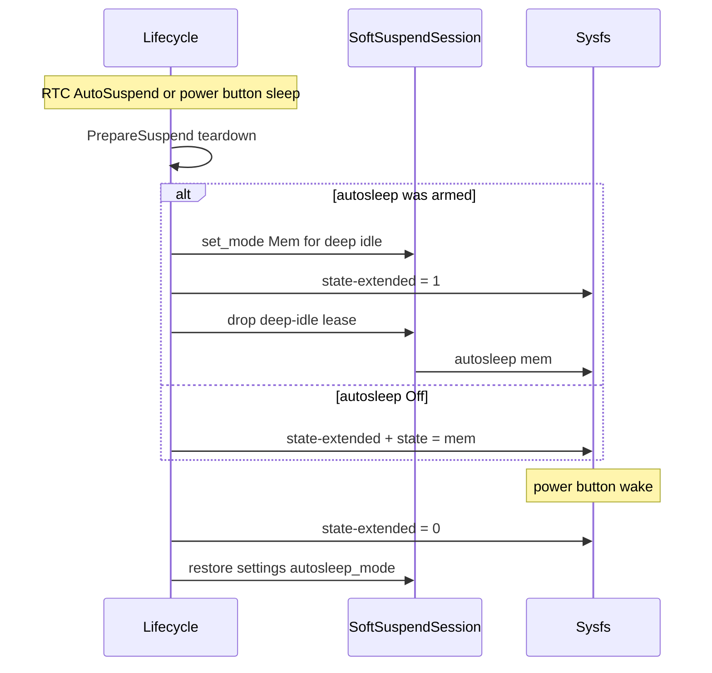

<!-- i18n:skip-start -->

# Kobo suspend and deep idle

Kobo-specific sleep paths for Cadmus. Generic soft-suspend lease/session
details live in [Soft Suspend](../soft-suspend.md). Research notes are in
[investigation #361](../../investigations/kobo/issue-361-autosleep-wake-lock.md).

## Classic hard suspend (soft suspend Off)

When `AutosleepMode` is `Off`, Auto Suspend / power button / sleep cover use
the classic path:

1. RTC [`AlarmType::AutoSuspend`](../../../../crates/core/src/device/rtc/mod.rs)
   fires → lifecycle `begin_suspend`
2. Intermission UI; wait [`PREPARE_SUSPEND_WAIT_DELAY`](../../../../crates/core/src/device/kobo/lifecycle/mod.rs)
   (3s) then PrepareSuspend teardown (settings, frontlight, Wi‑Fi)
3. Wait [`SUSPEND_WAIT_DELAY`](../../../../crates/core/src/device/kobo/lifecycle/mod.rs)
   (15s) then `Event::Suspend`
4. [`KoboPowerManager::suspend`](../../../../crates/core/src/device/kobo/power.rs):
   write `1` to `/sys/power/state-extended`, sync, write `mem` to
   `/sys/power/state`
5. On wake: `state-extended=0` (+ model-specific touch re-init); AutoPowerOff /
   Calendar RTC handling; re-sleep loop until the user cancels

## Soft-suspend deep idle (mode armed)

When soft suspend is armed (`freeze` or `mem` for light naps), the same
user-facing sleep triggers enter **deep idle** instead of writing
`/sys/power/state`:

1. Acquire a named `deep-idle` cycle lease so autosleep cannot freeze mid-cycle
2. PrepareSuspend / Suspend run **without** the 3s / 15s delays — the cycle
   lease keeps the SoC awake through teardown and RTC work
3. Force session autosleep to **`mem`** (deep idle always targets suspend-to-RAM,
   even if settings mode is `freeze`)
4. Arm vendor prep: `state-extended=1`
5. Drop the cycle lease (and any other holders) so autosleep enters `mem` —
   **no** userspace `state=mem` write
6. On wake / cancel: `state-extended=0`, restore the previous settings autosleep
   mode, drop the cycle lease, reschedule Auto Suspend RTC

RTC AutoPowerOff / Calendar while deep-idle re-acquire the cycle lease for the
processing window, then re-enter deep idle.

## `state-extended` is Kobo/NiX, not mainline

[`/sys/power/state-extended`](https://www.kernel.org/doc/Documentation/ABI/testing/sysfs-power)
does **not** appear in mainline `sysfs-power`. On Kobo it is a vendor kernel
patch: writing `1` runs platform hooks (e.g. Neonode touch off); writing `0`
reverses them. Writing `1` alone does **not** suspend the device.

Upstream autosleep (`/sys/power/autosleep` + wake locks) is what actually
sleeps when soft suspend is armed. See the
[sysfs-power ABI](https://www.kernel.org/doc/Documentation/ABI/testing/sysfs-power)
and [sleep-states admin guide](https://www.kernel.org/doc/html/latest/admin-guide/pm/sleep-states.html).

## Related APIs

| Piece                                                     | Role                                       |
| --------------------------------------------------------- | ------------------------------------------ |
| `AlarmType::AutoSuspend` / `AlarmManager`                 | Wall-clock idle deadline                   |
| Kobo lifecycle `begin_suspend` / PrepareSuspend / Suspend | Orchestration                              |
| `SoftSuspendSession`                                      | Autosleep mode + `cadmus` wake lock leases |
| `PowerManager::arm_deep_idle` / `disarm_deep_idle`        | Kobo `state-extended`                      |
| `KoboPowerManager::suspend`                               | Classic `state-extended` + `state=mem`     |

<!-- i18n:skip-end -->
