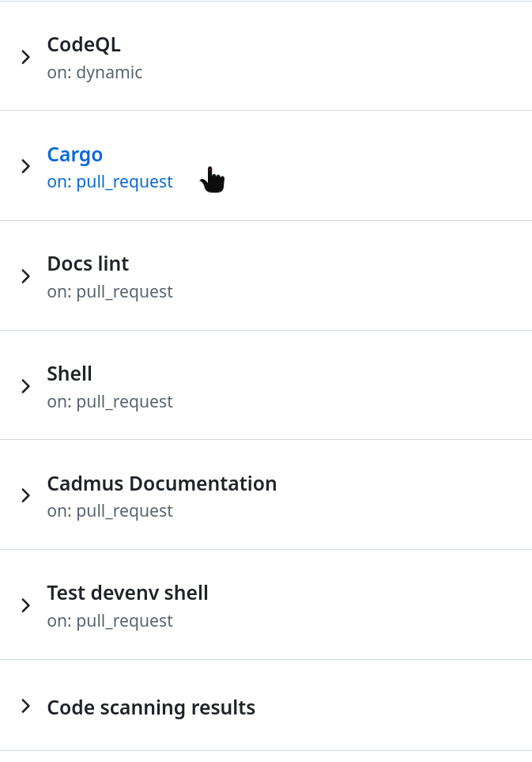

# Manually install PR build

To manually install a PR build, follow these steps:

1. Open the PR you want to install
2. Press the checks tab
   
3. Press the cargo job
   
4. Scroll to the files and download the package you want:
   - `cadmus-kobo-<suffix>` — Cadmus only
   - `cadmus-kobo-nm-<suffix>` — Cadmus + NickelMenu
   - `cadmus-kobo-test-tracing-<suffix>` — test build with extra diagnostics
     (USB only; see [Test builds](test-builds.md))
   - `cadmus-kobo-nm-test-tracing-<suffix>` — same, plus NickelMenu
   
5. Extract the download if your browser saved it as a zip.

Afterward, follow the [installation](index.md) instructions accordingly.
