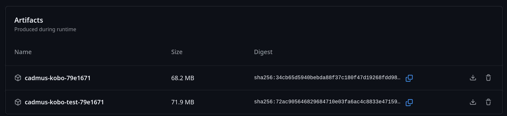

# Test builds

## First-time install

1. Open the [Cadmus GitHub Actions page](https://github.com/OGKevin/cadmus/actions/workflows/cargo.yml).
2. Select the run for the change you want to test.
3. Download the `cadmus-kobo-test-<suffix>` artifact.
   
4. Extract it and pick the KoboRoot [variant](./index.md) that matches your setup.
5. Copy the selected KoboRoot file to:
   `/mnt/onboard/.kobo/KoboRoot.tgz`
6. Eject the device and reboot.

## Updating an existing test build

Use the in-app OTA feature to download the latest artifact from a PR number.
This avoids reinstalling via USB.
