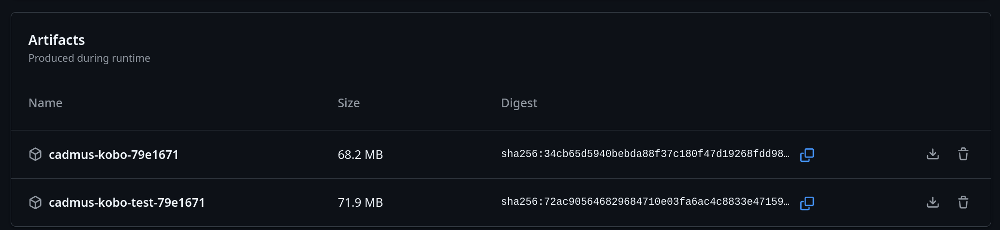

# Test builds

## First-time install

1. Open the [Cadmus GitHub Actions page](https://github.com/OGKevin/cadmus/actions/workflows/cargo.yml).
2. Select the run for the change you want to test.
3. Download the package that matches your setup:
   - `cadmus-kobo-test-<suffix>` — test build only
   - `cadmus-kobo-nm-test-<suffix>` — test build + NickelMenu
   
4. Extract the download if your browser saved it as a zip.
5. Rename the package to `KoboRoot.tgz`.
6. Copy that renamed file to:
   `/mnt/onboard/.kobo/KoboRoot.tgz`
7. Eject the device and reboot.

> [!NOTE]
> Test packages such as `KoboRoot-test.tgz` and `KoboRoot-nm-test.tgz` must be
> renamed to `KoboRoot.tgz` before you copy them to your Kobo.

> [!NOTE]
> Runs also include `cadmus-kobo-test-tracing-<suffix>` (and a NickelMenu
> variant). That is a debug package with extra diagnostics. Install it the
> same way over USB. Wireless updates will not install it.

## Updating an existing test build

Use the OTA feature to download updates from a PR number directly on your
device. This lets you test changes without connecting to a computer.

## Switching builds

When both the main and test builds are installed, open the Exit menu and choose
**Switch to Test** or **Switch to Main**. Cadmus hands off to the other install
without going through Nickel. Quit still returns you to Nickel as usual.
