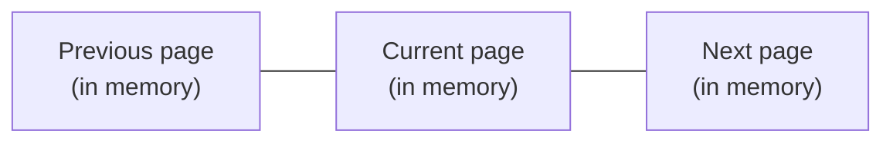
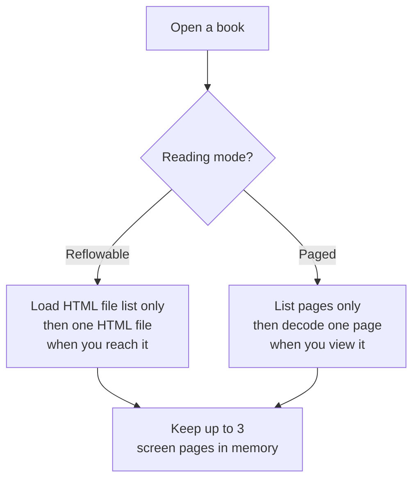

# Reader

When you open a book, Cadmus shows it in the **Reader**. How a book is loaded
depends on its type:

- [Reflowable books](reflowable.md) — EPUB and HTML. Text is laid out to fit
  your screen, font size, and margins.
- [Paged books](paged.md) — comics (CBZ) and other page-based files such as
  PDF. Each page is a fixed image or sheet.

## What stays in memory while you read

Cadmus uses two kinds of memory, depending on the book type:

1. **Screen pages (all books)** — Cadmus draws a page only when it needs to
   show it (or to prepare a neighbor). It does **not** pre-draw the whole book.
   At most **three** of those finished screen images stay in memory at once.
2. **HTML file layouts (reflowable only)** — the laid-out pages of each EPUB
   HTML file you have already opened. See [Reflowable books](reflowable.md).

### Screen pages in memory

Only the page you are on is required. Cadmus usually also keeps the previous and
next pages when they exist — **up to three** finished screen images total.
Pages outside that window are discarded from memory and drawn again if you
return to them.

In **fit-to-page** and **fit-to-width** zoom modes, Cadmus prepares the previous
and next pages in the background after a turn, so they are ready when you move
again.

How Cadmus first opens the file still differs by mode:

Details:

- [Reflowable books](reflowable.md)
- [Paged books](paged.md)

## Related settings

Shared reader options live under `[reader]` in
[Settings](../settings/index.md#reader), including what happens when you finish
a book, touch gestures, and screen refresh rates.
