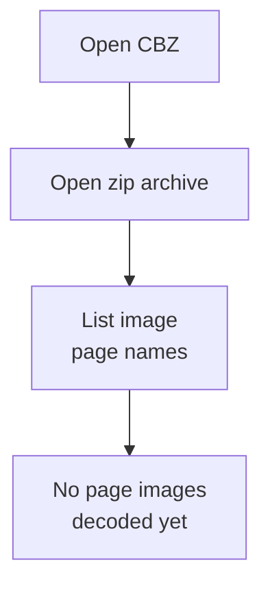
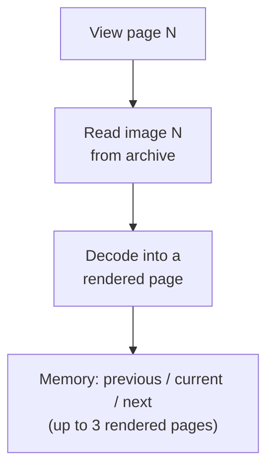

# Paged books

Paged books are made of fixed pages — typically one image or sheet per page.
Cadmus opens CBZ comic archives this way. Other page-based formats such as PDF
and standalone images use the same page-at-a-time model. DjVu books follow a
similar pattern through a separate decoder.

## Opening a CBZ

A CBZ file is a zip archive of images. When you open one, Cadmus opens the
archive and builds an ordered **list of image file names** that count as pages.
It does **not** decode every image up front.

## Turning pages

When you view a page, Cadmus:

1. Reads **that one page's image** from the archive.
2. Decodes it into a rendered screen page.
3. Keeps **up to three** rendered pages in memory — typically the current page
   plus the previous and next pages when they exist.

In **fit-to-page** and **fit-to-width** zoom modes, Cadmus prepares the previous and
next pages in the background after a turn. Pages outside that window are not
kept as finished screen images.

The rest of the CBZ stays on disk as zip entries until you navigate to those
pages. Cadmus may also reuse a limited amount of lower-level decoded data from
the page engine, but the Reader itself only retains that small rendered-page
window. See
[Reader](index.md#what-stays-in-memory-while-you-read).

## Related settings

These `[reader]` options are especially relevant for paged books. See
[Settings](../settings/index.md#reader) for full details:

- [`dithered-kinds`](../settings/index.md#readerdithered-kinds) — which file
  types start with dithering on first open
- [`continuous-fit-to-width`](../settings/index.md#readercontinuous-fit-to-width)
  — scroll mode used with fit-to-width zoom when a document is first opened
- [`refresh-rate`](../settings/index.md#readerrefresh-rate) — including optional
  per-file-type overrides such as `cbz`
