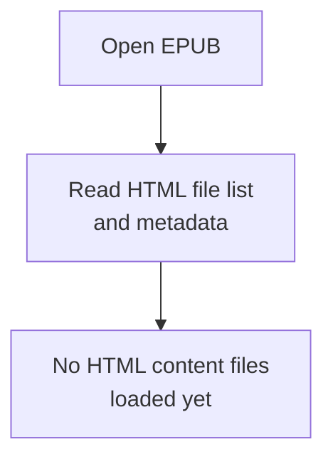
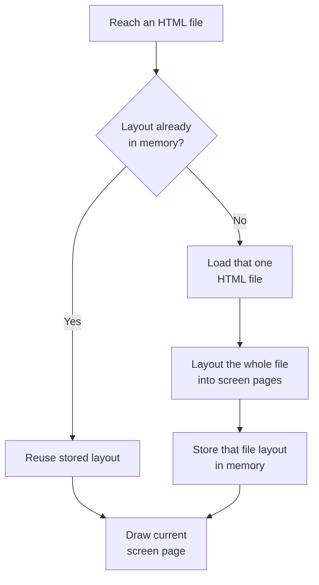

# Reflowable books

Reflowable books are EPUB files (and HTML documents). Cadmus lays the text out
to match your screen size, font, and margins.

## Opening a book

An EPUB is a package of **HTML files** (plus styles and images) listed in reading
order. When you open one, Cadmus reads that file list and related metadata. It
does **not** load every HTML file at that moment.

## Opening an HTML file

When you first reach content that lives in a given HTML file, Cadmus:

1. Loads **that one HTML file** (and its stylesheets, unless document CSS is
   ignored — see
   [Settings](../settings/index.md#readerignore-document-css)).
2. Lays **the whole file** out into screen pages for your current font, margins,
   and screen size.
3. Keeps that file's **layout** in memory for the rest of the session.

So the unit Cadmus loads is an HTML file, not a table-of-contents chapter. If
the EPUB puts the entire book in a single HTML file, opening it loads and lays
out that whole book at once. If the book is split across many HTML files, Cadmus
loads each file only when you reach it.

If you later return to an HTML file you already opened, Cadmus reuses the stored
layout instead of reading the file again. Visiting several files means several
layouts can sit in memory at once — still only the files you have opened.

Changing reading options that affect layout (for example font family, font
size, margins, line height, text alignment, or whether document CSS is used)
clears **all** stored HTML file layouts. Cadmus rebuilds a file the next time
you reach it.

Images referenced by an HTML file are loaded from the book when that file is
laid out or drawn.

On top of those file layouts, Cadmus still keeps **up to three screen pages**
in memory (current, and usually previous and next). See
[Reader](index.md#what-stays-in-memory-while-you-read).

## Related settings

These `[reader]` options affect reflowable layout. See
[Settings](../settings/index.md#reader) for full details:

- [`font-path`](../settings/index.md#readerfont-path),
  [`font-family`](../settings/index.md#readerfont-family),
  [`font-size`](../settings/index.md#readerfont-size)
- [`text-align`](../settings/index.md#readertext-align)
- [`margin-width`](../settings/index.md#readermargin-width)
- [`line-height`](../settings/index.md#readerline-height)
- [`ignore-document-css`](../settings/index.md#readerignore-document-css)
- [`paragraph-breaker`](../settings/index.md#readerparagraph-breaker)

Installing and choosing fonts is covered in [Fonts](../fonts.md).
