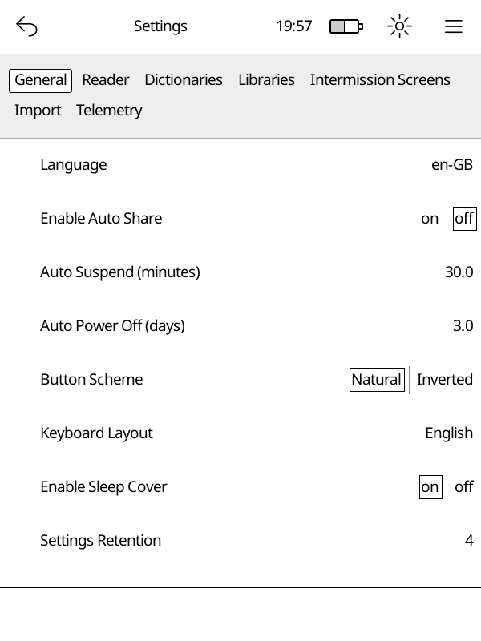

# Settings

The settings editor lets you change how Cadmus works. Open it from **Main Menu
→ Settings**.

Settings are organised into tabs — tap a category to open it.

## Categories

- **General** — language, button layout, Wi‑Fi idle timeout, startup mode
- **Power** — soft suspend, auto-suspend, auto power off, sleep cover
- **Reader** — default font family, finished-book action, default dithering
  by file type, and screen refresh rates
- **Libraries** — add, edit, or remove your book libraries
- **Dictionaries** — download and manage offline dictionaries
- **Import** — control how new books are picked up automatically
- **OTA** — download Cadmus updates directly to your Kobo
- **Telemetry** — logging options

### Power

Use the **Power** tab for sleep-related options:

- **Soft Suspend**, **Use LED to Indicate Soft Suspend**, and **Soft Suspend
  Release Grace** — shown only when the device supports soft suspend. Soft
  Suspend is optional opportunistic sleep (`Off`, `Freeze`, or `Memory`). See
  [Soft Suspend](../../soft-suspend.md). The LED option keeps the status LED
  on while soft suspend is armed and the device is awake. Release grace is
  seconds to stay awake after the last busy activity (`0` = unlock
  immediately).
- **Auto Suspend** — minutes of inactivity before a full suspend.
- **Auto Power Off** — days of inactivity before power off.
- **Enable Sleep Cover** — suspend when the cover closes.
